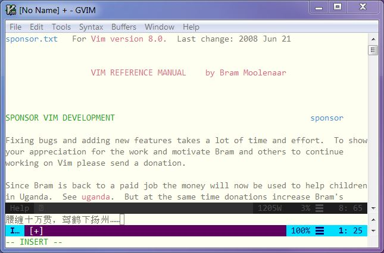

# A Starter Configuration for gVim 8

## Introduction

- Git for windows must be installed and the command git must be exposed in PATH.
- The recommended gVim distribution is https://github.com/vim/vim-win32-installer/.  
- The recommended install location is `%APPDATA%`. 
- This recommended package manager is https://github.com/k-takata/minpac.

## Installation

- Press Win+R and enter `%APPDATA%` to open the folder, and clone this repo into it: `git clone --recursive https://github.com/zh4ui/gvim8conf.git vim`.
- Download the zip archive (x86 or x64) from https://github.com/vim/vim-win32-installer/releases.
- Extract the downloaded zip archive, copy the vim runtime directory named `vim8` into `%APPDATA%\vim`
- Execute `%APPDATA%\vim\vim80\install.exe` to install the vim.
- Run `%APPDATA%\vim\fixreg.bat` to register "Edit with Vim Tab" in your context menu.

## TODO

- should use a script to get update from vim-win32-installer
